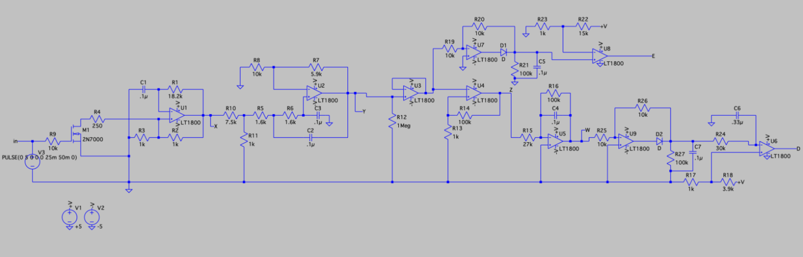
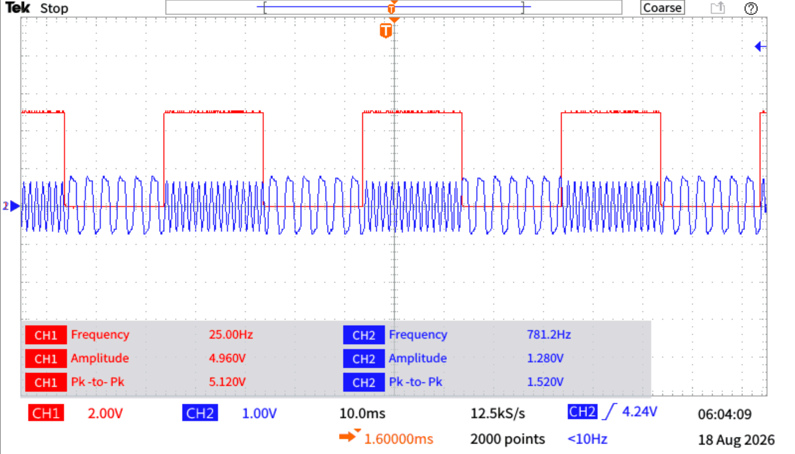
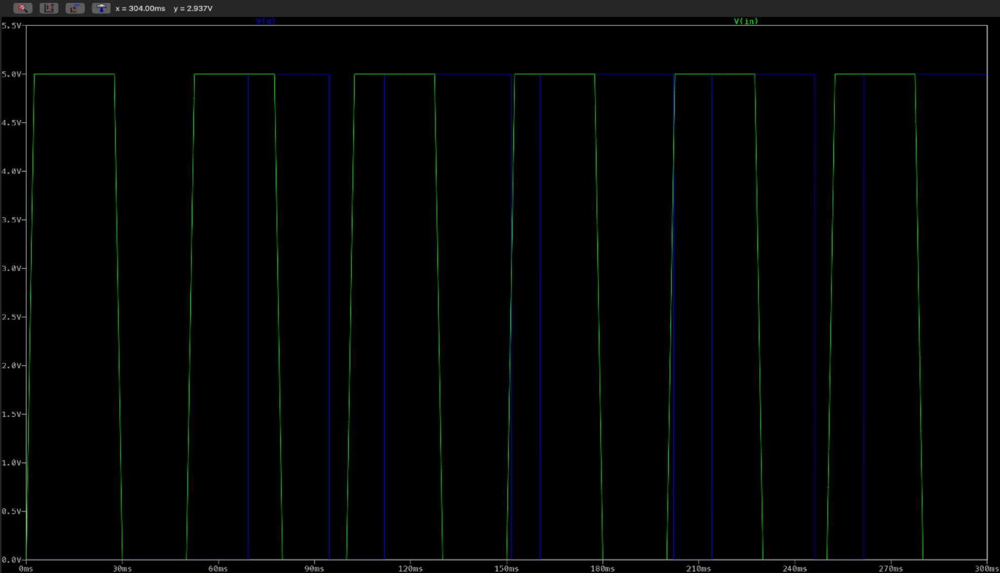
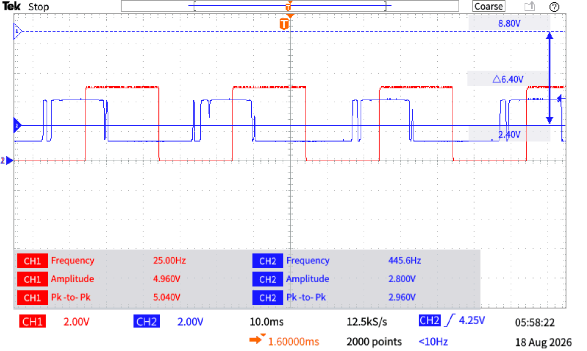

# Binary FSK Tone Modem

A discrete **binary frequency-shift keying (FSK)** link — an encoder that maps a digital bit onto one of two audio tones, and a decoder that recovers the bit and flags whether a valid tone is present. Built as a hands-on way into modulation theory, and as the first step toward exploring **chaotic-carrier secure communication**.

## Motivation

FSK is one of the simplest ways to see a core idea in communications made physical: information doesn't have to live in a signal's *amplitude* — it can ride on its *frequency*. That property is what makes FSK robust, since a channel can attenuate or distort amplitude while the frequency survives.

I built this to get the concept working end to end in hardware, not as an endpoint but as a foundation. The intended direction is **Chaos Shift Keying (CSK)** — the chaotic descendant of FSK, where the two fixed tones are replaced by two *chaotic carriers* and the bit is recovered through chaos synchronization at the receiver, with security coming from the carrier being noise-like and unpredictable. That approach was introduced in:

>S. Li, G. Álvarez, Z. Li, and W. A. Halang, "Analog Chaos-based Secure Communications and Cryptanalysis: A Brief Survey," arXiv:0710.5455 (2007). Freely available at https://arxiv.org/abs/0710.5455

This FSK modem is the deterministic groundwork for that trajectory, and it pairs with my separate Chua's-circuit chaotic-oscillator build, which is the carrier source CSK would use.

## What it does

Binary FSK with two symbols:

| Bit | Tone |
|---|---|
| 0 | 450 Hz |
| 1 | 800 Hz |

The two frequencies are spaced nearly an octave apart — chosen for wide spectral separation so the decoder's frequency discriminator has a large decision margin between symbols. The system runs on ±5 V rails and is TTL-compatible at both the encoder input and the decoder outputs.



## How it works

**Encoder (bit → tone).** A TTL control bit drives a 2N7000 that switches the effective timing resistance of an RC relaxation oscillator (U1), so the oscillation frequency shifts between the two symbols. A second-order Sallen-Key low-pass stage (U2, cutoff ~1 kHz) shapes the oscillator output toward a clean sinusoid by attenuating harmonics while passing both tones at similar amplitude.



**Decoder (tone → bit).** A 1 MΩ input buffer (U3) isolates the encoder, then the signal splits into two parallel paths that produce the two outputs:

- **E — valid-tone / carrier-detect.** A precision half-wave rectifier followed by an RC envelope detector and a comparator (~0.3 V threshold). E is **HIGH whenever either tone is present, LOW in silence.** It answers *"is anyone transmitting?"* — independent of which bit it is.
- **D — data.** A frequency discriminator (leaky integrator whose ripple/ramp amplitude differs between the two tones) feeding a precision peak detector and a decision comparator (~1 V reference). D is **LOW for 450 Hz (bit 0) and HIGH for 800 Hz (bit 1).** It answers *"what bit was sent?"*

The clean split is the useful part: E tells you a transmission is happening at all; D tells you its content.

## Results

**Simulation (LTspice) — full link works.** End to end, the encoder produces the two tones and the decoder cleanly recovers the bit: E asserts on tone-present, D tracks the input logic through both symbols. This is the reference for correct behavior.



**Hardware — proof of concept, with characterized limitations.** On the breadboard the encoder oscillates and shifts frequency with the input bit, the E detector correctly flags signal-present, and **the D output does recover the bit** — but imperfectly. The hardware decode shows a timing delay relative to the input, some waveform distortion, and a reduced peak-to-peak swing rather than a full rail-to-rail logic level.



So the concept is demonstrated in both simulation and on real hardware; the hardware output needs tuning to become a clean logic-level decode. The gaps are understood, not mysterious (see below).

## Known limitations & tuning direction

- **Op-amp rail behavior (main sim-vs-bench gap).** The simulation uses LT1800 rail-to-rail parts; the breadboard uses TL081, which can't swing within ~1.5 V of each rail on a single-ended output. This directly explains the reduced D swing and why the hardware decode doesn't reach clean 0/5 V TTL. Moving the two output decision stages to a real comparator (LM339/393 open-collector + pull-up) or a rail-to-rail part — while keeping the TL081s in the analog stages — is the fix, alongside re-simulating with the TL081 model so sim matches bench.
- **Encoder low-tone frequency.** Pre-tuning, the logic-0 tone measured ~322 Hz against the 450 Hz target; since f ∝ 1/RC, lowering the low-state timing resistance to ~0.72× pulls it up to target. The high tone measured ~781 Hz (close).
- **Discriminator decision margin.** The two tones' detector levels sit close together near the D comparator threshold, so the comparator can idle in its linear region. Widening the ripple-amplitude spread between tones and adding hysteresis on the D comparator sharpens the decision.
- **Decode latency.** The detector RC time constants trade ripple-smoothing against response speed; the observed delay is that trade-off, tunable by shortening the detector time constants once the swing issue is resolved.

## Where this goes

This is the deterministic baseline. The next step is replacing the two fixed sinusoidal tones with **two chaotic carriers** (Chaos Shift Keying, per Dedieu et al. above), generated by a Chua's circuit and recovered through synchronization at the receiver — trading the plainly-visible FSK spectrum for a noise-like, harder-to-intercept one. That connects this modem directly to my Chua's-circuit oscillator build and is the throughline I'm working toward: **understand how a bit rides on frequency → prove I can encode and recover it → make the carrier chaotic for security.**

## Bill of materials (key parts)

Oscillator/switching: 2N7000 (M1) · timing R1 18.2 kΩ, C1 0.1 µF. Shaping (Sallen-Key): R5=R6 1.6 kΩ, C2=C3 0.1 µF, gain set by R7 5.9 kΩ / R8 10 kΩ. Decoder: 1 MΩ input (R12); D-path discriminator R15 27 kΩ / R16 100 kΩ / C4 0.1 µF; precision rectifiers with 1N4148 diodes (D1, D2). Op-amps: LT1800 in LTspice / TL081 on breadboard (U1–U9). Rails: ±5 V.

## Repository structure

```
├── docs/          # schematic, encoder tone, decoder output (sim + hardware)
│                  #   schematic.png, encoder_tone.png,
│                  #   decoder_output_sim.png, decoder_output.png
└── README.md
```

## Tools

Hand analysis · LTspice · MATLAB · bench (oscilloscope, function generator, DMM)
